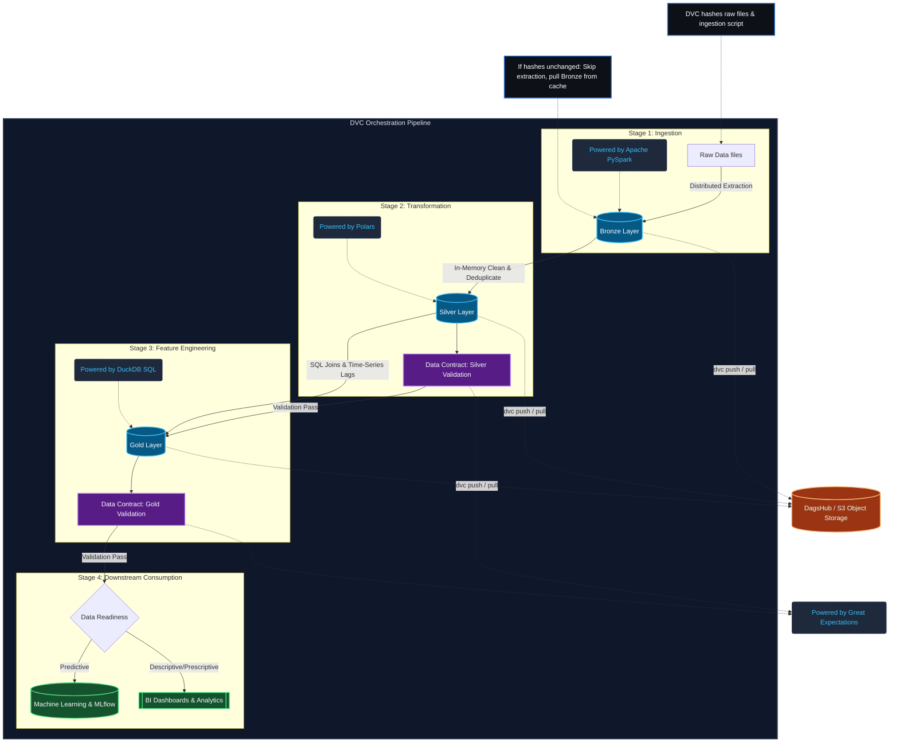

# High-Performance Medallion Data Architecture

**StoreCast** operates on a zero-budget(for local env), hardware-constrained local environment mimicking a multi-million-dollar enterprise scalable cloud ecosystem. To achieve this, the data architecture relies on a highly efficient **"Tri-Stack" Medallion ETL Pipeline** using purely open-source tooling, strictly orchestrated via **Data Version Control (DVC)**.

## Architecture Diagram & DVC Orchestration

Because data volumes scale beyond standard `git` capabilities, we rely on DVC to track massive Delta and Parquet files remotely (via DagsHub) while locally orchestrating the pipeline graph. 

One of the most powerful features of our pipeline is **DVC Caching (`dvc repro`)**. DVC algorithmically hashes the inputs and python scripts of every stage. If our PySpark ingestion logic and Bronze data haven't changed, but we adjust our Gold DuckDB query, `dvc repro` will instantly skip the Bronze and Silver extraction stages (pulling directly from cache) and only execute the Gold stage—saving massive compute resources!

## The "Tri-Stack" Tooling Rationale

Rather than defaulting to `pandas` or adopting heavyweight infrastructure like `dbt`, StoreCast uses a highly specialized "Tri-Stack" approach to data processing, adhering strictly to the "use the right tool for the job" mantra.

### 1. PySpark (Bronze Ingestion)
- **The Phase:** Raw data extract and append.
- **The Justification:** While Pandas must hold entire datasets in RAM, PySpark is a distributed engine that lazy-evaluates data. In our pipeline, PySpark effortlessly streams raw retail CSVs, inferring massive unstructured schemas and writing them out as compressed `Delta Lake` tables with ACID transaction guarantees. This proves our architecture can theoretically handle Petabyte-scale ingestion without rewriting code.

### 2. Polars (Silver Transformation)
- **The Phase:** Cleaning anomalies, deduplicating, and standardizing datatypes.
- **The Justification:** Polars is a blazingly fast DataFrame library written in Rust. Because Silver transformations (clipping negative sales, dropping duplicates, mapping types) are largely row-level operations, they are memory-bound. Polars evaluates queries natively using multi-threading and SIMD (Single Instruction, Multiple Data), mathematically outperforming PySpark overhead on single-node hardware.

### 3. DuckDB (Gold Modeling & Feature Engineering)
- **The Phase:** Analytics star-schema generation, deep time-series window functions.
- **The Justification:** Creating ML features (like a 52-week time-travel lag and a 4-week moving average over 4,500 stores simultaneously) via Pandas `.groupby().shift()` is highly prone to data leakage and massive memory spikes. **DuckDB** executes native vector-based zero-copy SQL directly against our Silver Delta tables. It flawlessly handles massive `LEFT JOINs` and `WINDOW PARTITION BY` analytical queries in fractions of a second, completely circumventing the need for expensive tools like `dbt` or Snowflake.

## The Quality Gates (Great Expectations)
A Medallion Lakehouse is useless if the data is poisoned. 
Between the Silver and Gold layers, we enforce strict **Data Contracts** mapped by Great Expectations (GX).

- **Silver Gates:** Ensure primary keys (`Store`, `Dept`, `Date`) are mathematically unique (no cartesian explosion duplicates) and sales constraints (no negative numbers) are held.
- **Gold Gates:** Ensure our advanced DuckDB features successfully mapped without returning catastrophic `NULL` explosions (except for expected mathematical warm-up periods). 
- **Automated Docs:** Each run automatically writes HTML Data Docs detailing the exact mathematical compliance of the pipeline. If a test fails, the pipeline errors out before the ML script can poison its weights!

## Pipeline Idempotency & Determinism
One of the most critical requirements of a production pipeline is **Idempotency**—the ability to run the pipeline multiple times without causing data corruption or duplication. 

- **Data Idempotency:** If the pipeline fails midway or is run twice by mistake, our Silver Polars logic utilizes strict primary-key upserts and distinct group-bys to ensure no cartesian duplicates ever propagate downstream.
- **Environment Determinism:** We abandoned legacy `pip` and `conda` in favor of **`uv`**. By using `uv` with a synchronized `pyproject.toml` and `uv.lock`, we mathematically guarantee that the python memory space running the DuckDB SQL window functions locally is identical to the containerized environment running in the cloud.

## Data Serialization & Storage Formats
The physical files that DVC pushes to our remote storage are strictly enforced big-data formats, not standard CSVs.

### Delta Lake (Bronze & Silver)
Our Bronze layer (PySpark) and Silver layer (Polars) persist data exclusively as **Delta Tables**. 
- **What is it?** A Delta table is not a single file; it is a directory containing highly-compressed `.parquet` files wrapped in a strict JSON transaction ledger called the `_delta_log`. 
- **ACID Guarantees:** In standard data engineering, if a pipeline fails halfway through writing a 2GB CSV file, the file is corrupted. With Delta, the ingestion is "All or Nothing." If a job fails, the JSON transaction log aborts the commit, and the table remains perfectly intact, shielding downstream consumers from poisoned data.
- **Data Time Travel:** Because Delta Lake utilizes "append-only" mechanics (it never overwrites old Parquet files, it just writes new ones and updates the ledger pointer), the history is perfectly preserved. This enables **Time Travel**. If an Engineer accidentally deletes critical rows, we can simply query the table locally or in DuckDB using `SELECT * FROM silver_table VERSION AS OF 2` or `TIMESTAMP AS OF '2026-01-01'` to instantly read the data exactly as it existed on that date. 

### Parquet (Gold Layer & BI Consumption)
The finalized Gold layer is written as strictly-typed **Parquet** files.
- **Columnar Storage:** Parquet stores data column-by-column rather than row-by-row. If a dashboard needs the sum of `weekly_sales`, the engine does not have to load the other 20 columns (temperatures, fuel prices, etc.) into RAM. It reads only the compressed sales column, resulting in 100x performance gains over CSVs.
- **Zero-Copy Remote ELT:** In development, dashboards query the local Parquet files. However, in production, engines like DuckDB use HTTP Range Requests to query the remote DagsHub Parquet files directly. DuckDB reads the Parquet metadata footer, identifies exactly where the necessary data lives on the remote server, and downloads only those specific chunks over the network. This provides blazing fast, zero-copy cloud ELT!
