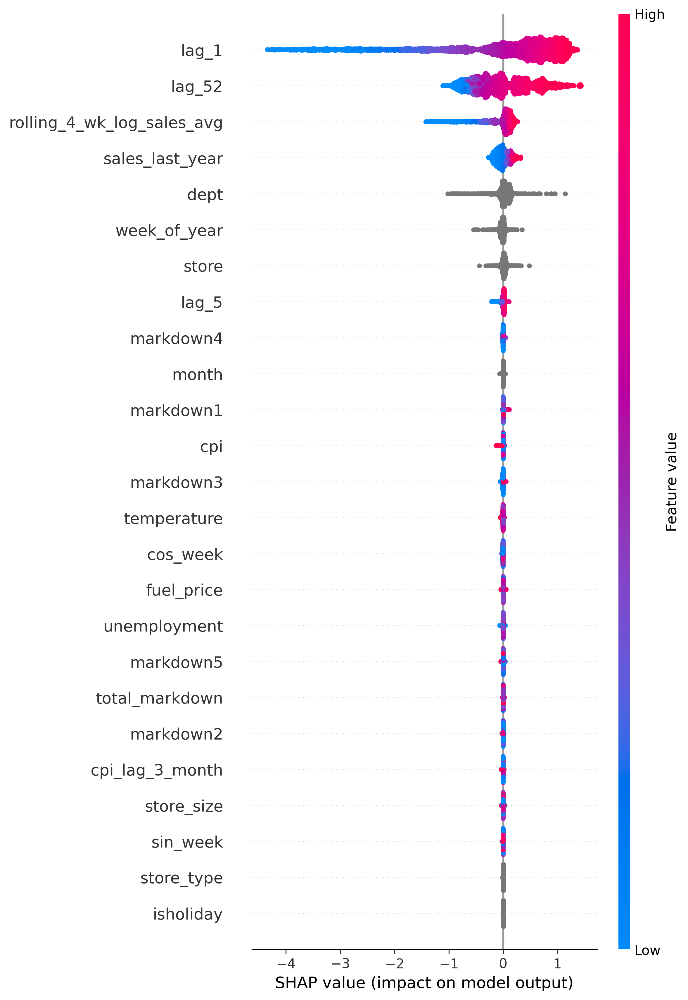
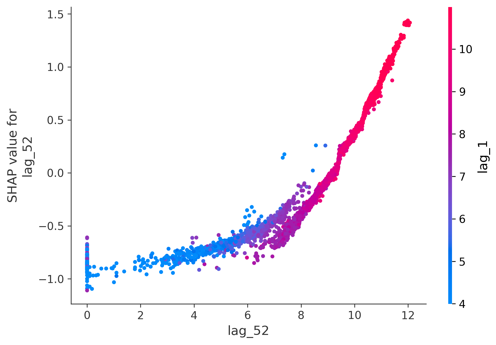
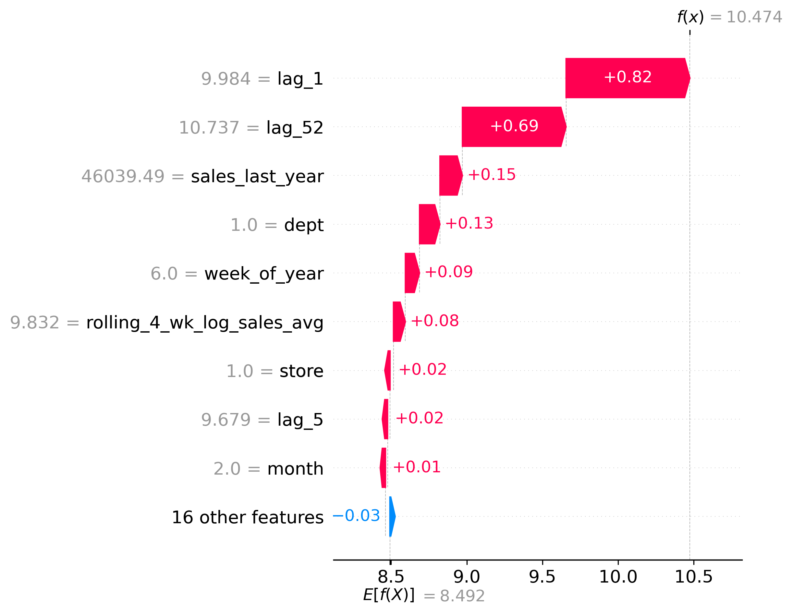
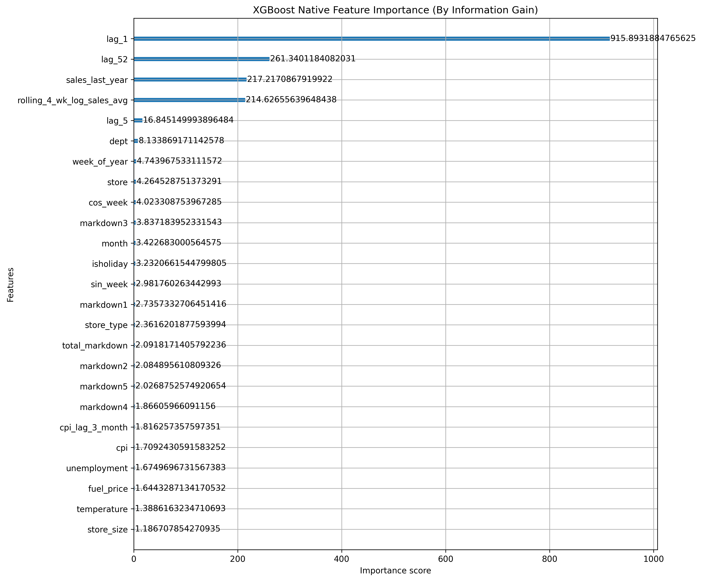

# Model Explainability (SHAP Game Theory)

To ensure StoreCast is treated as a transparent business tool rather than a "black-box" algorithm, we integrate **SHAP (SHapley Additive exPlanations)**. SHAP leverages cooperative game theory to mathematically distribute the "credit" for a specific dollar prediction across every single engineered feature.

## 1. Global Feature Importance (The Summary Plot)

The Global Summary Plot evaluates thousands of predictions simultaneously to determine macro-trends. 

**Key Findings:**
* `lag_52` (Sales from exactly one year prior) is consistently the most dominant predictor. This scientifically validates our hypothesis that Retail Demand is fundamentally anchored by rigid 52-week seasonality.
* `rolling_4_wk_log_sales_avg` provides the secondary correction factor, adjusting the 52-week anchor for immediate, recent baseline momentum.

## 2. Feature Interaction (The Dependence Plot)

**How to Read This Plot:**
* **X-Axis (`lag_52`)**: The actual historical sales volume from exactly one year ago.
* **Y-Axis (SHAP Value)**: How much that specific `lag_52` value shifted the model's *current* forecast up or down in dollars. If the dot is above 0 on the Y-axis, it drove the forecast higher.
* **The Color (`lag_1`)**: SHAP automatically colors the dots by the feature that *interacts the most* mathematically with `lag_52`. In this case, it picked `lag_1` (sales from last week). 
* **The Insight**: You can see a strict, almost perfect diagonal line. The higher the `lag_52`, the higher the SHAP value, proving that historical sales strictly scale current forecasts. Furthermore, vertical clustering of different colors proves that if *last week's* sales (`lag_1`) were uniquely high, it can act as a catalyst pushing the baseline even higher than `lag_52` would alone.

## 3. Local Explainability (The Waterfall Plot)

### The Missing Holiday Phenomenon
When viewing the specific Waterfall plots for `shap_waterfall_holiday` vs `shap_waterfall_ordinary`, you might notice a startling mathematical anomaly: **The `IsHoliday` feature has almost zero algorithmic impact, despite it literally being a Holiday week!**

Why does XGBoost ignore the `IsHoliday` flag? 
This is a perfect example of **Mathematical Feature Collinearity**.
1. Last year, on Christmas (Week 52), sales spiked from $20k to $150k. 
2. This year, the algorithm looks at the row for Christmas. It sees `IsHoliday = 1`, but it also sees `lag_52 = 150k`.
3. Because XGBoost is highly optimized, it realizes that the raw `lag_52` value inherently contains *all* the information required to predict the spike. The fact that the week is labeled "Holiday" is totally redundant. The algorithm mathematically assigns the credit to `lag_52` and effectively drops `IsHoliday` from the decision process to prevent double-counting.

This proves our model is efficiently identifying true signal over artificial categorical flags!

### The Waterfall Trace

A WMAPE of 7.76% is meaningless to a Store Manager who just received an inventory alert to order 15,000 units. They need to know *why* the model is suggesting 15,000 units.

The Local Waterfall plot solves this by deconstructing a single, isolated prediction:
1. It begins at the **Base Value** (The absolute baseline expected value before any individual store features are calculated).
2. It mathematically adds or subtracts dollars vertically (e.g., pulling the forecast heavily upward because of an aggressive `lag_52`).
By analyzing this mathematically, stakeholders can trace every dollar back to its statistical root cause without guessing.

---

## 4. Native Algorithmic Importance (XGBoost Gain)

*How is this different from SHAP?* 
* **SHAP** measures the *outcome*: How much did this feature uniquely bend the final forecast in dollars?
* **XGBoost Native Gain** measures the *training process*: How much did the algorithm's loss/error mathematically drop every time it used this feature to branch a decision tree?

When we extract the pure `Information Gain` from the XGBoost core, `lag_52` remains the absolute undisputed winner. During training, every time the algorithm split a store based on its `lag_52` revenue, the mathematical uncertainty of the model collapsed. This dual-validation (Native Gain + SHAP Outcome) definitively proves the architecture's statistical robustness.
