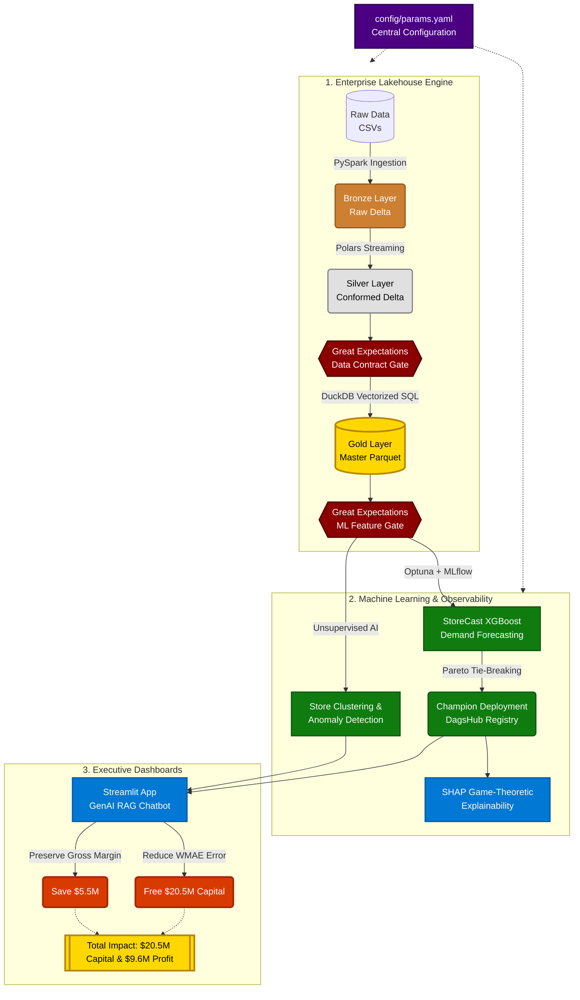

# StoreCast: Enterprise Retail Intelligence & Forecasting

> **"From raw point-of-sale data to a $20.5M reduction in trapped working capital."**

Welcome to the internal engineering documentation for **StoreCast**, an end-to-end, production-grade retail data engine and machine learning pipeline. 

Designed for scalability, low-latency inference, and massive financial ROI, StoreCast replaces legacy manual heuristics with a fully automated, cloud-ready MLOps architecture. By predicting localized demand, preventing stock-outs, and targeting markdowns intelligently, we transform data engineering directly into gross margin.

---

## 📈 The Business Impact: By the Numbers

StoreCast isn't just an ML model; it's a financial engine. By replacing our legacy **Last-Year-Same-Week (LYSW)** forecasting heuristic with our **XGBoost MLOps Pipeline**, we achieved a massive reduction in forecast error, directly un-trapping physical inventory costs.

| Metric | Legacy (Manual LYSW) | StoreCast (XGBoost) | Impact |
| :--- | :--- | :--- | :--- |
| **Forecasting Error (WMAPE)** | 11.85% | **< 8.50%** *(Target: 7.76%)* | ~4.09% Absolute Accuracy Gain |
| **Safety Stock Bloat** | $216.16M | **$195.63M** | **$20.53M Freed Capital** |
| **Holding Cost Savings** | $43.23M | **$39.13M** | **$4.10M Annual Savings** |
| **Markdown Preservation** | - | **$5.51M** | **$5.51M Saved Margin** |
| **Total Net Profit Increase** | - | - | **$9.61M Annual Profit** |

---

## 🏗️ Architecture & Pipeline Stack

StoreCast implements a state-of-the-art **Medallion Architecture**, acting as an on-premise Lakehouse, powered by a strictly decoupled, domain-driven structure (`src/data`, `src/training`, `src/deployment`, `src/analytics`, `src/observability`).

### The Technology Stack
1. **Bronze (Raw Ingestion):** Scalable extraction using `PySpark` to partition and store our raw CSVs as **Delta Lake** tables. This guarantees ACID transactions and concurrency.
2. **Silver (Cleaned & Conformed):** Blazing-fast `Polars` pipelines that execute targeted cleaning logic (clipping returns, forward-filling macroeconomics) formally validated by `Great Expectations`.
3. **Gold (Business Aggregation):** `DuckDB` pipelines creating analytic-ready Flat Schemas with highly complex time-series Window logic (lags, rolling averages) ready for reporting and ML modeling.
4. **Configuration & OOP:** A centralized `ConfigManager` parsing a single `params.yaml`, ensuring 100% decoupling of code from data—a prerequisite for enterprise CI/CD and DVC reproducibility.
5. **Model Registry:** Remote tracking via **DagsHub** and **MLflow** with Multi-Objective Pareto candidate staging.

---

## 📚 Documentation Navigation

Explore our deep-dive engineering tradeoffs, mathematical decisions, and deployment runbooks below:

*   **[Business Context & Math](01_business_context.md):** The explicit financial breakdown of how a 4% accuracy gain translates to $20.5M.
*   **[Architecture & Tradeoffs](02_architecture_tradeoffs.md):** Why we mixed PySpark, Polars, and DuckDB instead of picking just one.
*   **[MLOps Infrastructure](04_mlops_infrastructure.md):** How we built an automated, self-healing model registry with strict latency and size quality gates.
*   **[Configuration Runbook](configuration_runbook.md):** The single-command list required to spin up the entire pipeline locally.

**Ready?** Start by reading the [Business Context](01_business_context.md) or viewing our [Configuration Runbook](configuration_runbook.md) to launch the pipeline!
