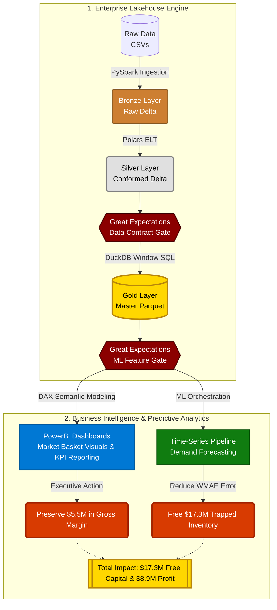

# StoreCast: Retail Intelligence & Forecasting

Welcome to the internal documentation for **StoreCast**, our production-grade retail data engine and machine learning pipeline. 

This system is designed to optimize inventory and promotional markdown strategies for our 45-store pilot region, targeting a massive **$17.3M reduction in trapped working capital**.

## Project Architecture & Business Deliverables
StoreCast implements a state-of-the-art **Medallion Architecture**, acting as an on-premise Lakehouse:

### The Pipeline Stack
1. **Bronze (Raw Ingestion):** Scalable extraction using `PySpark` to partition and store our raw CSVs as **Delta Lake** tables. This guarantees ACID transactions and concurrency.
2. **Silver (Cleaned & Conformed):** Blazing-fast `Polars` pipelines that execute targeted cleaning logic (clipping returns, forward-filling macroeconomics) formally validated by `Great Expectations`.
3. **Gold (Business Aggregation):** `DuckDB` pipelines creating analytic-ready Flat Schemas with highly complex time-series Window logic (lags, rolling averages) ready for reporting and ML modeling.

## Tooling Stack
- **Dependencies:** `uv`
- **Data Versioning:** `dvc`
- **Documentation:** `mkdocs`
- **Data Engineering:** `PySpark`, `Polars`, `DuckDB`, `Delta Lake`
- **Analytics:** `pandas`, `structlog`

Navigate through the menu to explore the Business Metrics, Baseline Models, and EDA findings!
